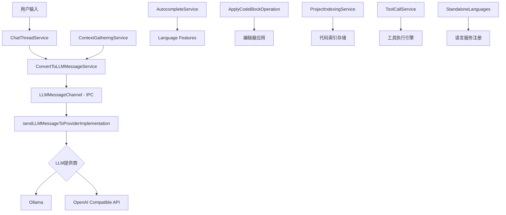

# VS Code AI编程助手完整实现文档

## 1. 整体架构概览



## 2. 核心服务组件

### 2.1 聊天线程服务 (ChatThreadService)
**位置**: `src/vs/workbench/contrib/void/browser/chatThreadService.ts`

**职责**:
- 管理用户与AI的对话会话
- 维护聊天历史记录
- 协调各个服务组件

**关键方法**:
```typescript
// 发送消息到LLM
async sendMessage(message: string, chatMode: ChatMode): Promise<void>
// 管理聊天线程状态
updateChatThread(threadId: string, updates: Partial<ChatThread>): void
```

### 2.2 消息转换服务 (ConvertToLLMMessageService)
**位置**: `src/vs/workbench/contrib/void/browser/convertToLLMMessageService.ts`

**职责**:
- 将VS Code内部消息格式转换为LLM API格式
- 处理不同聊天模式的消息结构
- 注入系统提示和上下文信息

**核心转换流程**:
```typescript
async prepareLLMChatMessages({
    chatMessages,
    modelSelection,
    chatMode
}): Promise<{
    messages: LLMMessage[],
    separateSystemMessage?: string
}> {
    // 1. 提取系统消息
    // 2. 转换用户消息格式
    // 3. 添加上下文信息
    // 4. 格式化为LLM API标准格式
}
```

### 2.3 跨进程通信 (LLMMessageChannel)
**位置**: `src/vs/workbench/contrib/void/electron-main/sendLLMMessageChannel.ts`

**架构设计**:
- **渲染进程**: 负责UI交互和用户体验
- **主进程**: 负责实际的LLM API调用
- **IPC通道**: 确保进程间的安全高效通信

**通信流程**:
```typescript
// 渲染进程发送请求
const response = await this.electronService.sendLLMMessage({
    messages,
    modelSelection,
    requestId
});

// 主进程处理并返回流式响应
onText: (data) => this.llmMessageEmitters.onText.fire({requestId, ...data}),
onFinalMessage: (data) => this.llmMessageEmitters.onFinalMessage.fire({requestId, ...data})
```

### 2.4 语言服务注册 (StandaloneLanguages)
**位置**: `src/vs/editor/standalone/browser/standaloneLanguages.ts`

**功能**:
- 注册各种语言服务提供者
- 集成AI功能到编辑器核心
- 提供代码分析和操作能力

**关键API**:
```typescript
// 注册代码操作提供者 (用于快速修复等)
export function registerCodeActionProvider(
    languageSelector: LanguageSelector, 
    provider: CodeActionProvider, 
    metadata?: CodeActionProviderMetadata
): IDisposable {
    const languageFeaturesService = StandaloneServices.get(ILanguageFeaturesService);
    return languageFeaturesService.codeActionProvider.register(languageSelector, {
        providedCodeActionKinds: metadata?.providedCodeActionKinds,
        documentation: metadata?.documentation,
        provideCodeActions: (model, range, context, token) => {
            const markerService = StandaloneServices.get(IMarkerService);
            const markers = markerService.read({ resource: model.uri })
                .filter(m => Range.areIntersectingOrTouching(m, range));
            return provider.provideCodeActions(model, range, {
                markers,
                only: context.only,
                trigger: context.trigger
            }, token);
        }
    });
}

// 注册文档格式化提供者
export function registerDocumentFormattingEditProvider(
    languageSelector: LanguageSelector, 
    provider: languages.DocumentFormattingEditProvider
): IDisposable

// 注册范围格式化提供者
export function registerDocumentRangeFormattingEditProvider(
    languageSelector: LanguageSelector, 
    provider: languages.DocumentRangeFormattingEditProvider
): IDisposable

// 注册输入时格式化提供者
export function registerOnTypeFormattingEditProvider(
    languageSelector: LanguageSelector, 
    provider: languages.OnTypeFormattingEditProvider
): IDisposable
```

## 3. LLM集成实现

### 3.1 支持的LLM提供商

#### Ollama (本地模型)
```typescript
// 本地Ollama API调用
const response = await fetch(`${ollamaBaseUrl}/api/chat`, {
    method: 'POST',
    headers: { 'Content-Type': 'application/json' },
    body: JSON.stringify({
        model: modelSelection.model,
        messages: formattedMessages,
        stream: true
    })
});
```

#### OpenAI兼容API
```typescript
// 支持OpenAI、Anthropic等
const response = await fetch(`${apiBaseUrl}/v1/chat/completions`, {
    method: 'POST',
    headers: {
        'Authorization': `Bearer ${apiKey}`,
        'Content-Type': 'application/json'
    },
    body: JSON.stringify({
        model: modelSelection.model,
        messages: formattedMessages,
        stream: true
    })
});
```

### 3.2 流式响应处理
```typescript
// 实时处理AI响应流
const reader = response.body?.getReader();
while (true) {
    const { done, value } = await reader.read();
    if (done) break;
    
    // 解析流式数据
    const chunk = new TextDecoder().decode(value);
    const parsedData = parseStreamChunk(chunk);
    
    // 触发UI更新事件
    onText({
        text: parsedData.content,
        isComplete: false
    });
}
```

## 4. 代码索引和存储机制

### 4.1 索引触发时机

**何时索引项目代码**：

1. **项目初始化时**
   ```typescript
   // 工作区打开时触发索引
   export class WorkspaceService {
       async onDidChangeWorkspaceFolders(event: IWorkspacesFoldersChangeEvent) {
           for (const folder of event.added) {
               await this.indexWorkspaceFolder(folder);
           }
       }
   }
   ```

2. **文件变更时增量索引**
   ```typescript
   // 监听文件系统变更
   class FileWatcher {
       onDidChangeFiles(changes: FileChange[]) {
           changes.forEach(change => {
               if (change.type === FileChangeType.UPDATED) {
                   this.updateFileIndex(change.resource);
               }
           });
       }
   }
   ```

3. **语言服务激活时**
   ```typescript
   // standaloneLanguages.ts 中的语言激活
   export function onLanguage(languageId: string, callback: () => void): IDisposable {
       return StandaloneServices.withServices(() => {
           const languageService = StandaloneServices.get(ILanguageService);
           const disposable = languageService.onDidRequestRichLanguageFeatures((encounteredLanguageId) => {
               if (encounteredLanguageId === languageId) {
                   // 触发该语言的代码索引
                   this.indexLanguageFiles(languageId);
                   callback();
               }
           });
           return disposable;
       });
   }
   ```

### 4.2 索引存储架构

**索引数据存储位置**：

```typescript
interface CodeIndexStorage {
    // 向量索引存储
    vectorStore: {
        embeddings: Float32Array[];      // 代码片段的向量表示
        metadata: CodeSnippetMetadata[]; // 对应的元数据
        index: VectorIndex;              // 向量搜索索引
    };
    
    // 全文搜索索引
    fullTextIndex: {
        invertedIndex: Map<string, Set<DocumentId>>; // 倒排索引
        tokenIndex: Map<string, TokenInfo[]>;        // 词法分析索引
        symbolIndex: Map<string, SymbolInfo[]>;      // 符号索引
    };
    
    // 语法树索引
    astIndex: {
        syntaxTrees: Map<DocumentId, SyntaxTree>;
        symbolTable: Map<string, SymbolDefinition[]>;
        referenceGraph: Map<string, Reference[]>;
    };
}
```

**具体存储实现**：
```typescript
class ProjectIndexingService {
    private readonly indexStorage = {
        // 存储在用户数据目录
        baseDir: path.join(os.homedir(), '.vscode', 'ai-assistant', 'index'),
        
        // 向量数据库 (使用SQLite + 向量扩展)
        vectorDB: new VectorDatabase('code_vectors.db'),
        
        // 全文搜索 (使用Lucene-like索引)
        fullTextDB: new LuceneIndex('fulltext.idx'),
        
        // AST缓存 (JSON格式)
        astCache: new FileCache('ast_cache')
    };
}
```

### 4.3 混合搜索策略

**同时支持向量搜索和全文搜索**：

```typescript
class HybridSearchService {
    async searchRelevantCode(query: string, context: SearchContext): Promise<CodeSnippet[]> {
        // 1. 向量语义搜索
        const vectorResults = await this.vectorSearch(query, {
            topK: 20,
            threshold: 0.7
        });
        
        // 2. 全文关键词搜索
        const fullTextResults = await this.fullTextSearch(query, {
            fuzzy: true,
            boost: {
                functionNames: 2.0,
                comments: 1.5,
                identifiers: 1.2
            }
        });
        
        // 3. 混合评分和排序
        const combinedResults = this.combineAndRank(vectorResults, fullTextResults, {
            vectorWeight: 0.6,
            fullTextWeight: 0.4,
            contextBoost: context.currentFile ? 1.3 : 1.0
        });
        
        return combinedResults.slice(0, 10);
    }
}
```

## 5. 工具调用系统

### 5.1 工具调用架构

**工具调用流程**：

```typescript
interface ToolCallSystem {
    // 工具注册表
    toolRegistry: Map<string, ToolDefinition>;
    
    // 执行引擎
    executionEngine: ToolExecutionEngine;
    
    // 步骤分解器
    stepDecomposer: TaskStepDecomposer;
}
```

### 5.2 支持的工具集合

**可调用的工具类型**：

1. **文件操作工具**
   ```typescript
   class FileOperationTools {
       async readFile(path: string): Promise<string> {
           return this.fileService.readFile(URI.file(path));
       }
       
       async writeFile(path: string, content: string): Promise<void> {
           return this.fileService.writeFile(URI.file(path), content);
       }
       
       async createDirectory(path: string): Promise<void> {
           return this.fileService.createFolder(URI.file(path));
       }
   }
   ```

2. **代码分析工具**
   ```typescript
   class CodeAnalysisTools {
       async parseAST(code: string, language: string): Promise<SyntaxTree> {
           const parser = this.getParser(language);
           return parser.parse(code);
       }
       
       async findDefinitions(symbol: string, workspace: URI): Promise<Definition[]> {
           return this.languageService.findDefinitions(symbol, workspace);
       }
       
       async getCallHierarchy(position: Position): Promise<CallHierarchy> {
           return this.languageService.getCallHierarchy(position);
       }
   }
   ```

3. **终端执行工具**
   ```typescript
   class TerminalTools {
       async executeCommand(command: string, cwd?: string): Promise<CommandResult> {
           return this.terminalService.executeCommand({
               command,
               cwd: cwd || this.workspaceService.getWorkspaceFolder()?.uri.fsPath
           });
       }
       
       async runTests(testPattern?: string): Promise<TestResults> {
           return this.testService.runTests(testPattern);
       }
   }
   ```

4. **搜索和导航工具**
   ```typescript
   class SearchTools {
       async searchInWorkspace(query: string, options: SearchOptions): Promise<SearchResult[]> {
           return this.searchService.search(query, options);
       }
       
       async findReferences(symbol: string): Promise<Reference[]> {
           return this.languageService.findReferences(symbol);
       }
   }
   ```

### 5.3 步骤分解和执行

**任务分解执行流程**：

```typescript
class TaskStepDecomposer {
    async decomposeTask(userRequest: string, context: WorkspaceContext): Promise<ExecutionPlan> {
        // 1. 分析用户意图
        const intent = await this.analyzeIntent(userRequest);
        
        // 2. 生成执行计划
        const plan = await this.generatePlan(intent, context);
        
        // 3. 分解为具体步骤
        const steps = await this.decomposeSteps(plan);
        
        return {
            intent,
            steps,
            dependencies: this.analyzeDependencies(steps)
        };
    }
    
    async executeStep(step: ExecutionStep): Promise<StepResult> {
        const tool = this.toolRegistry.get(step.toolName);
        if (!tool) {
            throw new Error(`Tool ${step.toolName} not found`);
        }
        
        // 执行工具调用
        const result = await tool.execute(step.parameters);
        
        // 记录执行结果
        this.logStepExecution(step, result);
        
        return result;
    }
}
```

**具体执行示例**：
```typescript
// 用户请求："帮我重构这个函数，提取公共逻辑"
const executionPlan = {
    intent: "REFACTOR_FUNCTION",
    steps: [
        {
            id: "1",
            name: "analyze_function",
            toolName: "code_analysis",
            parameters: {
                action: "parse_function",
                location: currentSelection
            }
        },
        {
            id: "2", 
            name: "identify_common_logic",
            toolName: "pattern_detector",
            parameters: {
                codeSnippet: "${step1.result.functionBody}"
            },
            dependsOn: ["1"]
        },
        {
            id: "3",
            name: "generate_refactored_code", 
            toolName: "code_generator",
            parameters: {
                patterns: "${step2.result.patterns}",
                originalCode: "${step1.result.code}"
            },
            dependsOn: ["2"]
        },
        {
            id: "4",
            name: "apply_changes",
            toolName: "file_editor",
            parameters: {
                edits: "${step3.result.edits}"
            },
            dependsOn: ["3"]
        }
    ]
};
```

## 6. 上下文信息处理系统

### 6.1 上下文收集策略

**多层次上下文收集**：

```typescript
class ContextGatheringService {
    async gatherContext(request: UserRequest): Promise<AIContext> {
        const context: AIContext = {
            // 1. 编辑器上下文
            editorContext: await this.getEditorContext(),
            
            // 2. 工作区上下文  
            workspaceContext: await this.getWorkspaceContext(),
            
            // 3. 语言服务上下文
            languageContext: await this.getLanguageContext(),
            
            // 4. 历史对话上下文
            conversationContext: await this.getConversationContext(),
            
            // 5. 相关代码上下文
            codeContext: await this.getRelevantCodeContext(request)
        };
        
        return this.optimizeContext(context);
    }
    
    private async getEditorContext(): Promise<EditorContext> {
        const activeEditor = this.editorService.activeTextEditor;
        if (!activeEditor) return {};
        
        return {
            currentFile: activeEditor.document.uri,
            selection: activeEditor.selection,
            visibleRange: activeEditor.visibleRanges[0],
            cursorPosition: activeEditor.selection.active,
            
            // 获取当前函数/类上下文
            currentScope: await this.getCurrentScope(activeEditor),
            
            // 获取相关导入
            imports: await this.getImports(activeEditor.document),
            
            // 获取当前文件的符号
            symbols: await this.getDocumentSymbols(activeEditor.document)
        };
    }
    
    private async getRelevantCodeContext(request: UserRequest): Promise<CodeContext> {
        // 基于请求内容搜索相关代码
        const relevantSnippets = await this.hybridSearch.searchRelevantCode(
            request.text, 
            {
                currentFile: this.editorService.activeTextEditor?.document.uri,
                maxResults: 10,
                includeTests: true,
                includeComments: true
            }
        );
        
        return {
            relevantSnippets,
            relatedFunctions: await this.findRelatedFunctions(relevantSnippets),
            dependencies: await this.analyzeDependencies(relevantSnippets),
            usageExamples: await this.findUsageExamples(relevantSnippets)
        };
    }
}
```

### 6.2 上下文优化和压缩

**智能上下文管理**：

```typescript
class ContextOptimizer {
    async optimizeContext(context: AIContext, maxTokens: number): Promise<OptimizedContext> {
        // 1. 计算各部分重要性权重
        const weights = this.calculateContextWeights(context);
        
        // 2. 按重要性排序
        const prioritizedSections = this.prioritizeContextSections(context, weights);
        
        // 3. 智能截断，保留最重要的信息
        let totalTokens = 0;
        const optimizedSections: ContextSection[] = [];
        
        for (const section of prioritizedSections) {
            const sectionTokens = this.estimateTokens(section);
            
            if (totalTokens + sectionTokens <= maxTokens) {
                optimizedSections.push(section);
                totalTokens += sectionTokens;
            } else {
                // 部分保留最重要的片段
                const truncatedSection = this.truncateSection(
                    section, 
                    maxTokens - totalTokens
                );
                if (truncatedSection) {
                    optimizedSections.push(truncatedSection);
                }
                break;
            }
        }
        
        return {
            sections: optimizedSections,
            totalTokens,
            compressionRatio: totalTokens / this.estimateTokens(context)
        };
    }
    
    private calculateContextWeights(context: AIContext): ContextWeights {
        return {
            currentSelection: 3.0,      // 当前选中代码最重要
            currentFunction: 2.5,       // 当前函数上下文
            relatedFunctions: 2.0,      // 相关函数
            imports: 1.8,               // 导入声明
            recentChanges: 1.5,         // 最近的修改
            conversationHistory: 1.2,   // 对话历史
            workspaceFiles: 1.0,        // 工作区其他文件
            documentation: 0.8          // 文档和注释
        };
    }
}
```

### 6.3 上下文注入策略

**将上下文注入到LLM消息中**：

```typescript
class ConvertToLLMMessageService {
    async prepareLLMChatMessages(params: {
        chatMessages: ChatMessage[],
        modelSelection: ModelSelection,
        chatMode: ChatMode
    }): Promise<{
        messages: LLMMessage[],
        separateSystemMessage?: string
    }> {
        // 1. 收集上下文
        const context = await this.contextGatheringService.gatherContext(
            params.chatMessages[params.chatMessages.length - 1]
        );
        
        // 2. 优化上下文大小
        const optimizedContext = await this.contextOptimizer.optimizeContext(
            context, 
            this.getMaxContextTokens(params.modelSelection)
        );
        
        // 3. 构建系统消息
        const systemMessage = this.buildSystemMessage(optimizedContext, params.chatMode);
        
        // 4. 转换用户消息
        const userMessages = await this.convertUserMessages(
            params.chatMessages,
            optimizedContext
        );
        
        return {
            messages: userMessages,
            separateSystemMessage: systemMessage
        };
    }
    
    private buildSystemMessage(context: OptimizedContext, chatMode: ChatMode): string {
        const sections = [
            `你是一个专业的AI编程助手，当前工作模式：${chatMode}`,
            
            // 当前文件信息
            context.editorContext?.currentFile && 
            `当前文件：${context.editorContext.currentFile.path}`,
            
            // 当前选中的代码
            context.editorContext?.selection && 
            `当前选中代码：\n\`\`\`\n${context.editorContext.selectedText}\n\`\`\``,
            
            // 相关代码片段
            context.codeContext?.relevantSnippets.length > 0 &&
            `相关代码片段：\n${context.codeContext.relevantSnippets.map(
                snippet => `\`\`\`${snippet.language}\n${snippet.content}\n\`\`\``
            ).join('\n\n')}`,
            
            // 项目结构信息
            context.workspaceContext?.projectStructure &&
            `项目结构：\n${JSON.stringify(context.workspaceContext.projectStructure, null, 2)}`
        ].filter(Boolean);
        
        return sections.join('\n\n');
    }
}
```

## 7. 代码编辑和应用

### 7.1 代码块操作 (ApplyCodeBlockOperation)

**位置**: `src/vs/workbench/contrib/chat/browser/actions/codeBlockOperations.ts`

**功能实现**:
```typescript
class ApplyCodeBlockOperation {
    async applyCodeBlock(
        codeBlock: string,
        targetModel: ITextModel,
        range?: Range
    ): Promise<void> {
        // 1. 解析AI生成的代码块
        const parsedCode = this.parseCodeBlock(codeBlock);
        
        // 2. 计算差异和最佳插入位置
        const edits = await this.computeEdits(parsedCode, targetModel, range);
        
        // 3. 预览差异给用户确认
        await this.showDiffPreview(edits);
        
        // 4. 应用编辑到编辑器
        await targetModel.pushEditOperations([], edits, () => null);
    }
}
```

### 7.2 自动补全集成

**位置**: `src/vs/workbench/contrib/void/browser/autocompleteService.ts`

```typescript
class AutocompleteService {
    async provideCompletions(
        model: ITextModel,
        position: Position
    ): Promise<CompletionList> {
        // 1. 收集相关上下文
        const relevantSnippets = await this._contextGatheringService
            .readCachedSnippets(model, position, 3);
        
        // 2. 构建上下文字符串
        const context = relevantSnippets
            .map(text => `${text}`)
            .join('\n-------------------------------\n');
        
        // 3. 发送到LLM获取补全建议
        const completion = await this.sendToLLM({
            context,
            currentCode: model.getValueInRange(range),
            position
        });
        
        return completion;
    }
}
```

## 8. 完整的AI处理流程

### 8.1 增强的用户请求流程

```
1. 用户在聊天界面输入问题
   ↓
2. ContextGatheringService 收集多层次上下文
   ├── 编辑器上下文 (当前文件、选中内容、光标位置)
   ├── 工作区上下文 (项目结构、依赖关系)
   ├── 代码索引上下文 (相关代码片段、符号定义)
   └── 对话历史上下文
   ↓
3. ContextOptimizer 优化上下文大小
   ↓
4. ConvertToLLMMessageService 转换消息格式并注入上下文
   ↓
5. 判断是否需要工具调用
   ├── 需要 → TaskStepDecomposer 分解任务步骤
   │   ↓
   │   ToolExecutionEngine 执行工具调用
   │   ↓
   │   收集工具执行结果
   └── 不需要 → 直接发送到LLM
   ↓
6. 通过 LLMMessageChannel 发送到主进程
   ↓
7. 主进程调用相应的LLM API
   ↓
8. 流式接收AI响应
   ↓
9. 如果响应包含代码，通过 ApplyCodeBlockOperation 应用到编辑器
   ↓
10. 更新对话历史和索引
```

### 8.2 自动补全流程（增强版）

```
1. 用户在编辑器中输入代码
   ↓
2. AutocompleteService 监听输入事件
   ↓
3. 收集当前上下文
   ├── 当前文件内容和结构
   ├── 光标位置的语法上下文
   ├── 相关导入和依赖
   └── 相似代码片段 (通过混合搜索)
   ↓
4. 发送上下文到LLM获取补全建议
   ↓
5. 在编辑器中显示补全建议
   ↓
6. 用户选择并应用补全
   ↓
7. 更新代码索引 (增量更新)
```

### 8.3 语言服务集成流程

```
1. 语言服务注册 (StandaloneLanguages)
   ├── registerCodeActionProvider (快速修复)
   ├── registerDocumentFormattingEditProvider (文档格式化)
   ├── registerDocumentRangeFormattingEditProvider (范围格式化)
   ├── registerOnTypeFormattingEditProvider (输入时格式化)
   ├── registerCompletionItemProvider (自动补全)
   ├── registerHoverProvider (悬停提示)
   └── registerCodeLensProvider (代码透镜)
   ↓
2. 语言激活事件触发
   ├── onLanguage - 丰富语言特性激活
   └── onLanguageEncountered - 基础语言特性激活
   ↓
3. 触发代码索引和AI服务初始化
   ↓
4. 提供AI增强的语言服务功能
```

## 9. 技术特点总结

### 9.1 架构优势
- **多进程架构**: 确保UI响应性和系统稳定性
- **模块化设计**: 各服务职责明确，易于维护和扩展
- **插件化集成**: 与VS Code语言服务深度集成
- **事件驱动**: 基于事件的响应式架构

### 9.2 索引和搜索能力
- **多模态索引**: 向量索引 + 全文索引 + AST索引
- **实时更新**: 文件变更时增量索引
- **混合搜索**: 语义搜索与关键词搜索结合
- **智能缓存**: 基于LRU的智能缓存策略

### 9.3 工具调用能力
- **丰富的工具集**: 文件操作、代码分析、终端执行、搜索导航
- **智能任务分解**: 自动将复杂任务分解为可执行步骤
- **依赖管理**: 处理步骤间的依赖关系
- **错误恢复**: 步骤执行失败时的恢复机制

### 9.4 上下文处理能力
- **多层次上下文**: 编辑器、工作区、语言服务、对话历史
- **智能优化**: 基于重要性权重的上下文压缩
- **动态调整**: 根据模型能力动态调整上下文大小
- **相关性分析**: 基于语义相似性的上下文筛选

### 9.5 AI能力
- **多LLM支持**: 灵活支持不同的AI模型
- **上下文感知**: 基于代码结构的智能上下文收集
- **流式交互**: 实时响应用户操作
- **代码理解**: 深度集成语法分析和语义理解

### 9.6 用户体验
- **实时反馈**: 流式显示AI响应
- **差异预览**: 代码修改前的可视化预览
- **智能建议**: 基于上下文的精准代码建议
- **无缝集成**: 与VS Code原生功能完美融合

## 10. 关键文件结构

```
src/vs/
├── workbench/contrib/void/
│   ├── browser/
│   │   ├── chatThreadService.ts          # 聊天线程管理
│   │   ├── convertToLLMMessageService.ts # 消息格式转换
│   │   ├── autocompleteService.ts        # 自动补全服务
│   │   └── contextGatheringService.ts    # 上下文收集
│   └── electron-main/
│       └── sendLLMMessageChannel.ts      # IPC通信处理
├── workbench/contrib/chat/browser/actions/
│   └── codeBlockOperations.ts            # 代码块操作
├── editor/standalone/browser/
│   └── standaloneLanguages.ts            # 语言服务注册
└── editor/contrib/codelens/browser/
    └── codelensController.ts             # 代码透镜控制
```

---

这个AI编程助手通过精心设计的架构，实现了从用户输入到AI响应，再到代码应用的完整闭环，为开发者提供了强大而智能的编程支持。整个系统具有高度的可扩展性和可维护性，能够适应不断发展的AI技术和用户需求。
